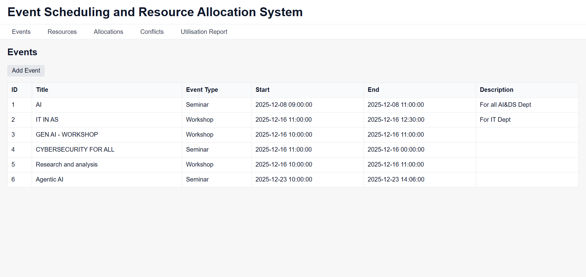
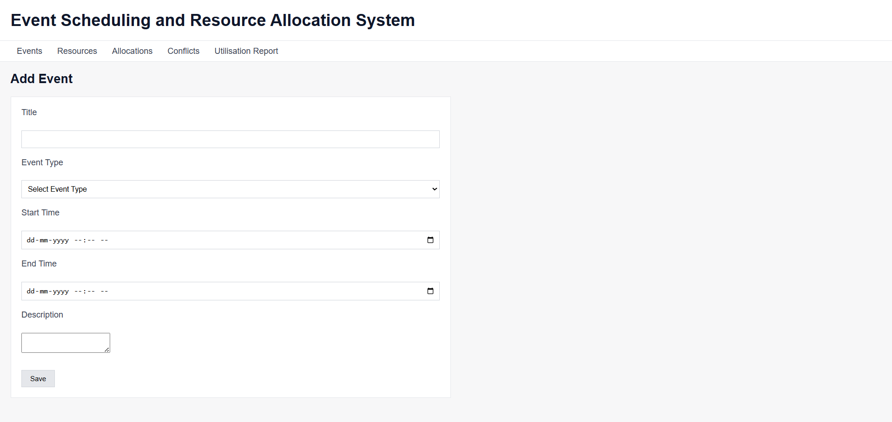
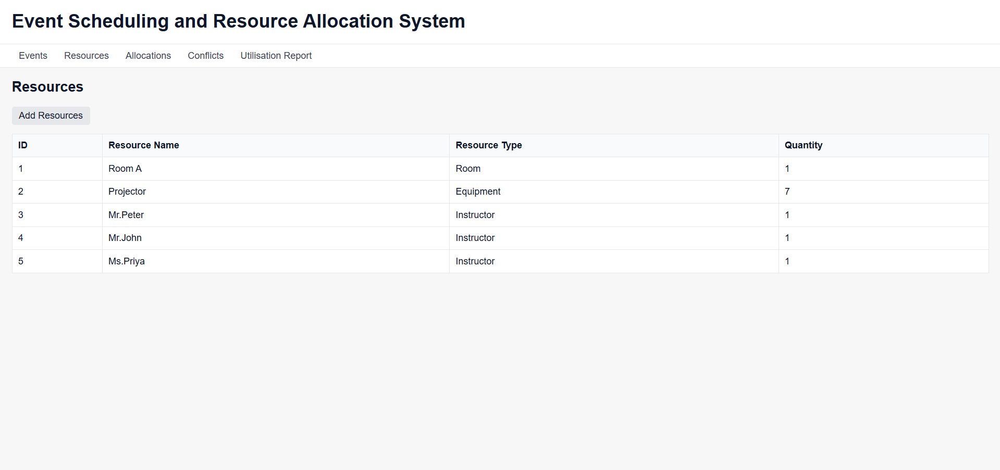
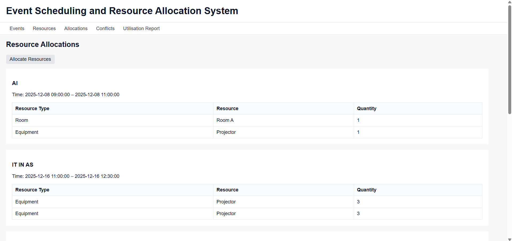
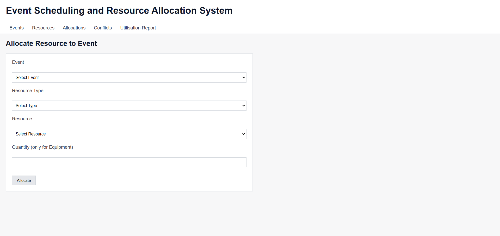
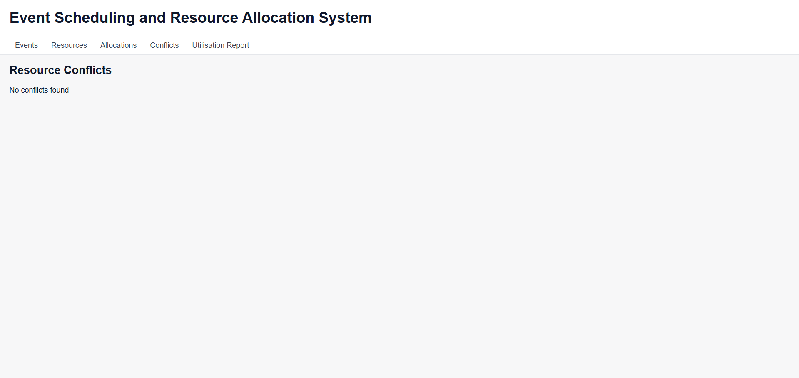
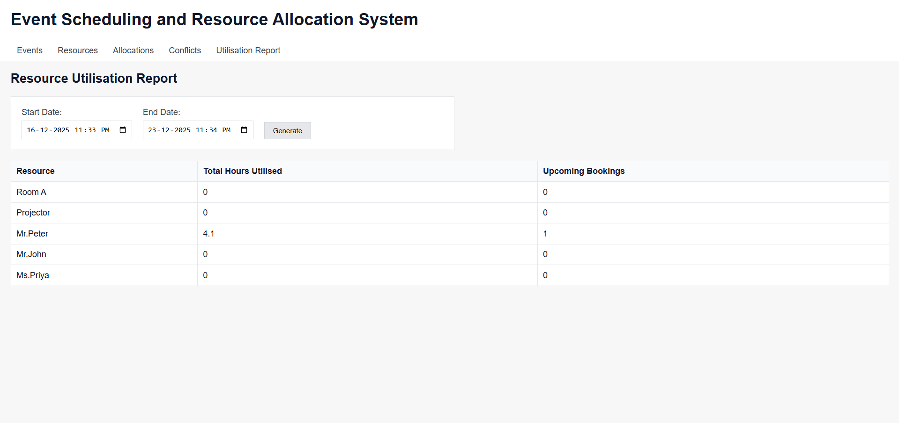

### flask-event-scheduler

## Flask environment setup
- Successfully set up the flask environment
- Verified flask application and template rendering
- Configured SQLAlchemy and created a test database

## UI Design
**Figma Design**  
https://www.figma.com/board/nepfVNshc9RZeY38tc2KGJ/Untitled?node-id=0-1&t=3EEnQFt8EUZUL4ov-1

## Screenshots

### Events Page

### Resources Page

### Resource Allocations

### Conflict

### Utilisation Report
